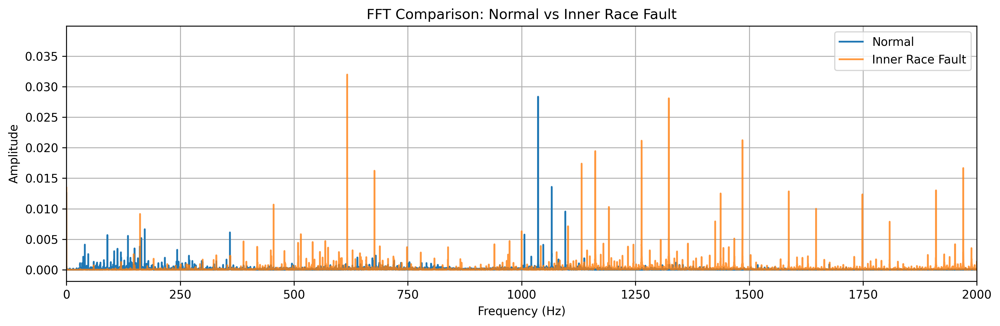
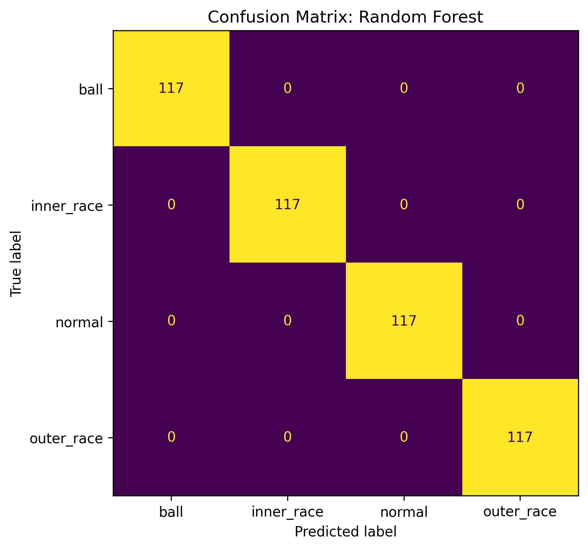
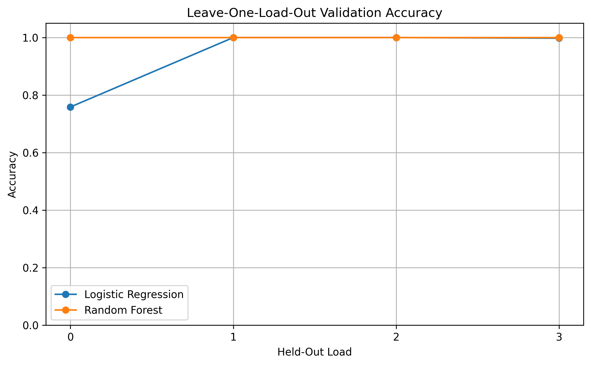
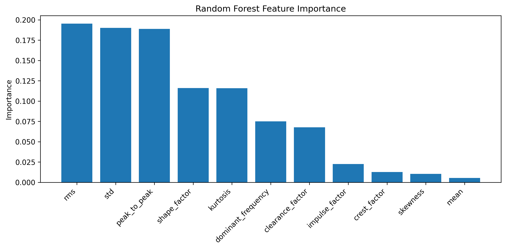

# Bearing Condition Monitor — Version 1 Results

## Purpose

This document summarises the results obtained for Version 1 of the Bearing Condition Monitor project. Version 1 was developed as a vibration-based bearing fault diagnosis pipeline using engineered signal features and classical machine learning on a controlled subset of the CWRU bearing dataset.

## Version 1 Scope

Version 1 focused on four bearing conditions:

- Normal
- Inner race fault
- Ball fault
- Outer race fault

The analysis used 12 kHz drive-end vibration data and a controlled 16-file subset of the benchmark dataset:

- 4 normal files
- 4 inner race fault files
- 4 ball fault files
- 4 outer race fault files

All faulty cases used the 0.007 inch fault diameter configuration, and the selected files covered four operating loads: 0, 1, 2, and 3 HP.

## Dataset Construction

The raw signals were segmented into overlapping windows and converted into engineered feature vectors. The initial feature table contained 3064 samples, but the class distribution was imbalanced because the normal files were longer and therefore produced more windows.

Initial class counts were:

- Normal: 1652
- Inner race: 472
- Outer race: 471
- Ball: 469

To remove this imbalance, the dataset was balanced by sampling the same number of windows from each source file. The shortest file contributed 117 windows, so Version 1 used:

- 117 windows per source file
- 16 source files total
- 1872 samples overall
- 468 samples per class

This balanced dataset was used for training and validation.

## Engineered Features

Version 1 used the following engineered vibration features:

- Mean
- Standard deviation
- RMS
- Peak-to-peak amplitude
- Crest factor
- Shape factor
- Impulse factor
- Clearance factor
- Skewness
- Kurtosis
- Dominant frequency

These features were chosen to capture both amplitude-based and impulsive characteristics of vibration signals, along with a simple frequency-domain descriptor.

## Signal Comparison Example

Before model training, the vibration signals were compared in the frequency domain to confirm that healthy and faulty bearings showed meaningful differences in spectral behaviour.

This FFT comparison shows that the healthy and faulty signals differ not only in amplitude behaviour but also in frequency content, supporting the use of engineered diagnostic features for classification.

## Models Evaluated

Two classifiers were tested in Version 1:

- Logistic Regression
- Random Forest

Logistic Regression was used as a simple linear baseline. Random Forest was used as a stronger nonlinear model and also allowed feature-importance analysis.

## Held-Out Load Test Results

For the first benchmark, the models were trained using load conditions 0, 1, and 2, and tested on load 3.

The train/test split contained:

- 1404 training samples
- 468 test samples

### Logistic Regression

Logistic Regression achieved an accuracy of 0.997863.

Its confusion matrix was:

- ball: 117 correctly classified
- inner race: 117 correctly classified
- normal: 116 correctly classified, 1 misclassified as ball
- outer race: 117 correctly classified

This means Logistic Regression made only one classification error on the held-out test set.

### Random Forest

Random Forest achieved an accuracy of 1.000000.

Its confusion matrix showed perfect classification across all four classes, with all 468 test samples correctly identified.

## Leave-One-Load-Out Validation

To make the validation stronger, Version 1 also used leave-one-load-out testing. In this setup, each operating load was held out in turn as the test condition, while the remaining three loads were used for training.

The mean accuracies across the four folds were:

- Logistic Regression: 0.939103
- Random Forest: 1.000000

This is an important result because it shows that the Random Forest classifier remained perfectly accurate even when tested repeatedly on unseen operating loads.

## Feature Importance Results

Feature-importance analysis was carried out using the trained Random Forest model. The top ranked features were:

1. RMS — 0.195354
2. Standard deviation — 0.190127
3. Peak-to-peak amplitude — 0.188955
4. Shape factor — 0.116099
5. Kurtosis — 0.115798
6. Dominant frequency — 0.075006
7. Clearance factor — 0.067667
8. Impulse factor — 0.022568
9. Crest factor — 0.012750
10. Skewness — 0.010370

## Engineering Interpretation

The Version 1 results indicate that the selected feature set captures the dominant differences between healthy and faulty bearing vibration signals.

The highest-ranked features were RMS, standard deviation, and peak-to-peak amplitude. This suggests that overall vibration energy and amplitude spread are major sources of class separation in this benchmark.

Shape factor and kurtosis were also highly important. That is physically meaningful because faulty bearings often generate impulsive and non-Gaussian vibration signatures, especially when damage produces repeated impacts.

Dominant frequency also contributed to the classification performance, which indicates that spectral differences between classes were present in addition to time-domain differences.

The very strong Logistic Regression result shows that the engineered feature space is already highly informative. The stronger Random Forest result suggests that the remaining class boundaries are not purely linear and are better captured by a nonlinear ensemble model.

## Overall Conclusion for Version 1

Version 1 successfully established a complete and technically credible bearing fault diagnosis workflow.

The main outcomes of Version 1 are:

- successful ingestion and processing of raw CWRU vibration data
- clear separation of the four bearing conditions using engineered features
- near-perfect linear baseline performance
- perfect Random Forest classification on the held-out-load test
- perfect mean Random Forest accuracy under leave-one-load-out validation
- physically interpretable feature-importance results

These results should be interpreted as strong benchmark performance on a controlled laboratory dataset. They do not by themselves prove industrial deployment readiness, but they do show that the Version 1 pipeline is technically sound, well structured, and effective for bearing fault diagnosis under varying operating loads.

## Suggested Use of This Document

